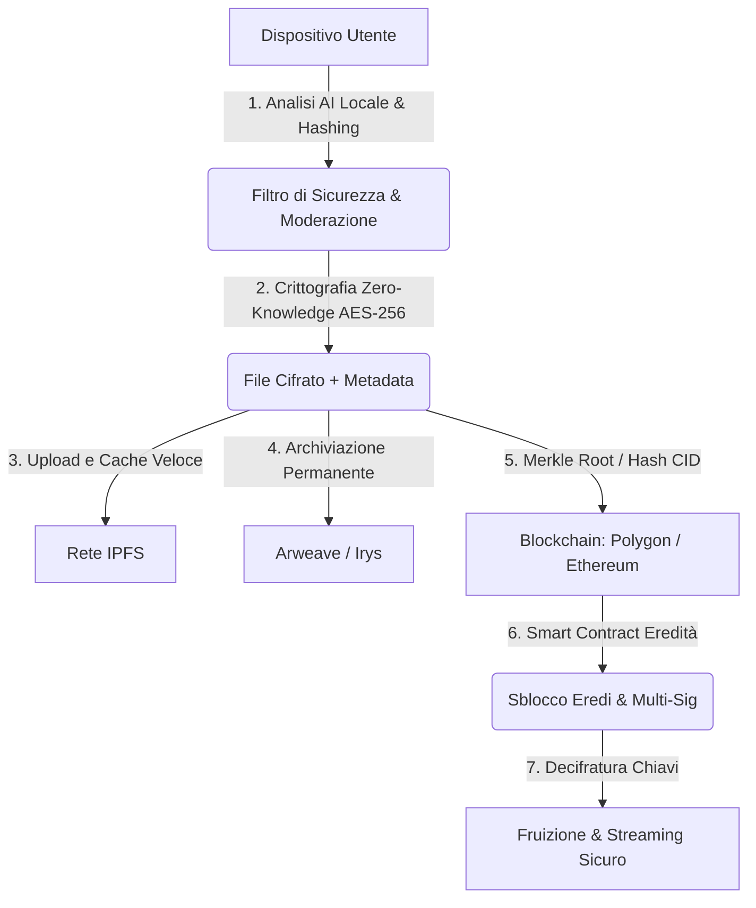

# Lascito — Custodi della Memoria dell'Umanità

> *"Non si tratta solo di archiviare dati, ma di salvaguardare l'essenza dell'esperienza umana, assicurando che la memoria personale e culturale non vada mai perduta."*

---

## 1. Visione e Missione
**Lascito** nasce per rispondere al bisogno universale di eternità e preservazione della memoria. Il sistema offre una cassaforte digitale decentralizzata, permanente e crittografata, capace di custodire nel tempo non solo dati o documenti, ma storie personali, ideologie, riflessioni e ricordi, garantendo la trasmissione alle future generazioni tramite ereditarietà digitale automatizzata.

---

## 2. Flusso Tecnico Completo

### Step 1: Upload Sicuro
* **Crittografia Zero-Knowledge**: Eseguita direttamente *client-side* sul dispositivo dell'utente prima della trasmissione di qualsiasi pacchetto di rete.
* **Analisi AI locale**: Rilevamento preventivo sul dispositivo per il blocco di contenuti illeciti prima che lascino l'ambiente utente.
* **Identificatore univoco**: Calcolo dell'hash crittografico (CID IPFS o Merkle root).

### Step 2: Upload e Distribuzione
* **IPFS**: Distribuzione peer-to-peer ad alta velocità per streaming, anteprima e disponibilità immediata.
* **Arweave**: Archiviazione distribuita e permanente (*permaweb*) con replicazione garantita nel tempo ("pay once, store forever").

### Step 3: Proof of Ownership e Immutabilità
* **Certificazione su Blockchain**: Registrazione dell'impronta (hash) su Ethereum o Layer 2 (es. Polygon/Arbitrum).
* **Alberi di Merkle**: Raggruppamento e batching degli hash per abbattere drasticamente i costi di transazione (gas fee).

### Step 4: Eredità Digitale Automatica
* **Smart Contract di Successione**: Gestione automatizzata di condizioni di sblocco temporali (es. timelock, dead man's switch) o eventi verificabili.
* **Multi-Signature & Threshold Cryptography**: Frammentazione delle chiavi di decifratura (es. Shamir's Secret Sharing o TSS) distribuite tra eredi e custodi designati.

### Step 5: Perpetuità Attiva
* **Protezione dall'Obsolescenza dei Formati**: Servizio programmato per la transcodifica periodica dei file video verso standard moderni a lungo termine.
* **Ridondanza e Replicazione**: Monitoraggio dell'integrità dei dati e backup incrociato tra IPFS e Arweave.

### Step 6: Fruizione e Accesso
* **Controllo Esclusivo**: Decifratura accessibile unicamente al titolare o agli eredi verificati tramite smart contract.
* **Piattaforma Web/Mobile**: Interfaccia user-friendly per gestione delle memorie, pianificazione successoria e riproduzione in streaming.

---

## 3. Matrice Tecnologica

| Area | Tecnologia Adottata | Ruolo & Note |
| :--- | :--- | :--- |
| **Crittografia** | AES-256-GCM + ZK (Zero-Knowledge) | Riservatezza assoluta; chiavi generate e conservate solo dal client. |
| **Storage Rapido** | IPFS (InterPlanetary File System) | Cache distribuita, indicizzazione rapida e streaming a bassa latenza. |
| **Storage Permanente** | Arweave (o Irys/Bundlr) | Modello di conservazione perpetua garantita (*Permaweb*). |
| **Immutabilità & Notarizzazione** | Ethereum / Polygon (L2) | Registrazione della prova d'esistenza con Merkle tree per ottimizzare il gas. |
| **Eredità Digitale** | Smart Contract Multi-Sig / Timelock | Esecuzione automatica e vincolante delle volontà dell'utente. |
| **Gestione Formati** | Worker di Transcodifica Periodica | Manutenzione evolutiva dei codec per evitare l'obsolescenza decennale. |
| **Moderazione & Conformità** | AI Locale (ONNX/Wasm) + Hash Blacklist | Prevenzione proattiva di contenuti non conformi sul dispositivo sorgente. |

---

## 4. Vantaggi Chiave

* 🔒 **Privacy Inviolabile**: Nessun intermediario o server centrale ha mai accesso ai dati in chiaro.
* 🏛️ **Permanenza Decennale/Secolare**: Dati immuni a fallimenti aziendali, censure o chiusura di singoli server.
* 📜 **Valore Probatorio & Notarile**: Prova inconfutabile di proprietà intellettuale, data certa e integrità del contenuto.
* 👥 **Successione Programmabile**: Passaggio generazionale delle memorie sicuro, legalmente orientato e privo di attriti burocratici.
* ⚡ **Esperienza Fluida**: Mascheramento della complessità Web3 per utenti non tecnici grazie ad astrazione dell'account e recupero sociale.

---

## 5. Criticità & Strategie di Mitigazione

1. **Costi di archiviazione per video HD/4K**:
   * *Mitigazione*: Compressione avanzata client-side (AV1 / H.265), upload a batch e archiviazione selettiva (storage caldo temporaneo su IPFS e perma-storage su Arweave per gli archivi definitivi).
2. **Rischio di perdita delle chiavi (Key Recovery)**:
   * *Mitigazione*: Implementazione di *Social Recovery* e *Shamir's Secret Sharing* con guardiani fidati senza esporre la chiave completa.
3. **Obsolescenza dei Codec**:
   * *Mitigazione*: Monitoraggio continuo e job periodici di migrazione verso formati aperti e standardizzati (es. MP4/WebM/AV1).
